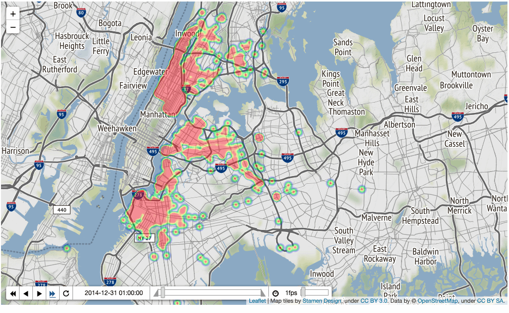

# Data_Analysis_of_Taxi_Pickups_in_NewYork
# NYC Green Taxi Commission - Exploratory Data Analysis
## Introduction
This project focuses on Exploratory Data Analysis (EDA) of the New York City Green Taxi Commission dataset. The dataset contains information on taxi pickups in New York City and has approximately 80 million rows in Parquet format, with a size of around 2GB. The analysis aims to gain insights into taxi deployments based on monthly, weekly, and hourly patterns, providing valuable information for a startup planning to launch a new taxi service in the city.

## Execution Time Breakup
The execution time for the entire EDA process with 80 million rows is as follows:

Average, Monthly, Weekly, and Hourly Pickups: Approximately 15-20 minutes each.
Hourly Pickups for Every Month: Approximately 2.5 hours.
HeatMap: Approximately 15 minutes.
Total Time of Execution: Approximately 4 hours.

## Objective
The main objective of this EDA is to analyze taxi pickups based on monthly, weekly, and hourly patterns. By understanding these patterns, the startup can make informed decisions regarding the deployment of taxis to efficiently meet the demand of passengers.

## Technologies Used
The EDA script is written in Python and utilizes the following libraries:

PySpark Pandas
Matplotlib
Plotly Express
Plotly Subplots
Plotly Graph Objects
Folium
Datashader
Colorcet
Pandas

## Data Retrieval
The dataset is stored in Microsoft Azure cloud storage. The script accesses the data remotely using the Azure storage access information and Spark, and then it is converted into a PySpark Pandas DataFrame for analysis.

## Data Preprocessing
Before conducting the analysis, the following preprocessing steps are performed on the data:

Dropping unnecessary columns (puLocationId, doLocationId, and ehailFee) from the DataFrame.
Extracting useful information from the timestamp, such as the weekday, hour, month, day, and year, to facilitate time-based analysis.

## Exploratory Data Analysis
The EDA is divided into several sections to analyze taxi pickups from different perspectives:

Average Pickups per Day: This section provides the number of pickups and the average daily pickups from the entire dataset, offering an overview of the overall demand for taxis.

Monthly Taxi Pickups: Analyzes the number of taxi pickups on a monthly basis, visually represented using a bar chart. This helps identify any seasonal patterns or trends in demand throughout the year.

Weekday Taxi Pickups: Examines the number of taxi pickups on each day of the week, represented through a bar chart. This provides insights into weekly variations in taxi demand.

Hourly Taxi Pickups: Investigates the number of taxi pickups during different hours of the day, visualized with a bar chart. This section highlights peak hours of demand and the need for taxi deployments at specific times.

Weekday Pickups Every Month: Shows a bar chart that displays the number of taxi pickups for each day of the week across all the months. This helps understand if the weekly patterns remain consistent throughout the year.

Comparing Hourly Pickups for Each Month: Visualizes the hourly taxi pickups for each month separately, presenting a bar chart for each month. This section helps to observe any changes in hourly demand patterns over the year.

Animated Heat Map for the Busiest Day: Utilizes a heat map with time animation to visualize the busiest day's taxi pickups. The heat map displays the busiest areas in New York City during that day.

## Conclusion
The EDA provides valuable insights into the demand for taxis based on monthly, weekly, and hourly patterns. Understanding these patterns can help the startup optimize taxi deployments, focusing on peak hours and high-demand locations. With the knowledge gained from this analysis, the startup can make informed decisions to efficiently serve passengers and run a successful taxi service in New York City.

## Running the Script
To execute the EDA script, follow these steps:

Ensure you have the necessary libraries installed (PySpark Pandas, Matplotlib, Plotly Express, Plotly Subplots, Plotly Graph Objects, Folium, Datashader, Colorcet, Pandas).

Set up the Azure storage access information in the script to access the dataset remotely.

Run the script in your Python environment, and the EDA process will begin.

